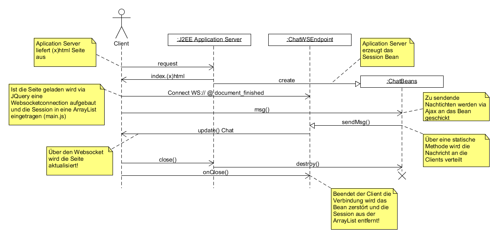

# ChatWebApplication
A Chat Application using J2EE Websocket, JSF, AJAX and JQUERY

<h2>Aufgaben</h2>
<ul>
<li>Anzahl der Angemeldeten Clients anzeigen</li>
<li>Benutzernamen vergeben</li>
<li>Farbe f. den eigenen Chat wählen</li>
<li>Die letzten 10 Nachrichten sollen auch nach einem Refresh (F5) erhalten bleiben</li>
</ul>
